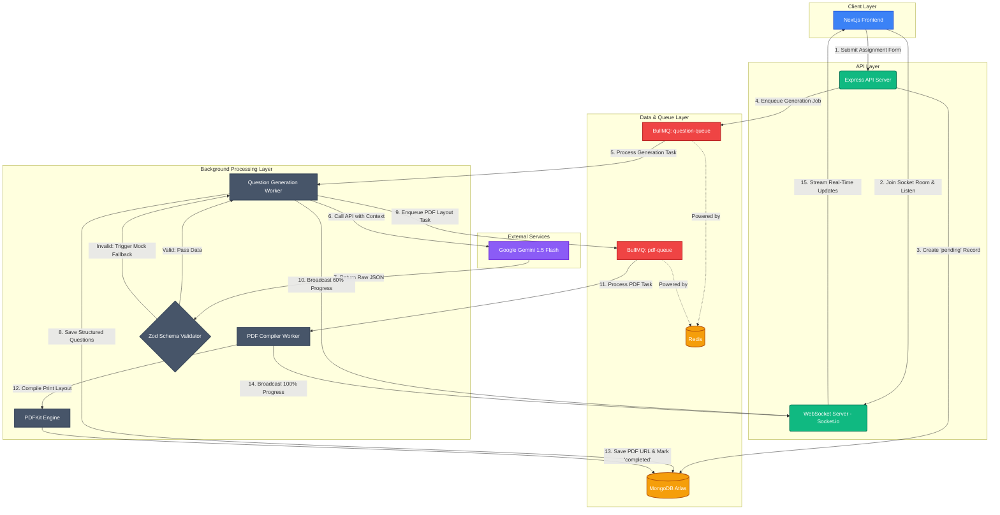

# EduGenie - AI Assessment Creator

An advanced, full-stack AI-powered examination and assessment creator that allows educators to instantly generate high-fidelity, structured exam papers grounded in course guidelines or uploaded files (PDF/TXT).

Built as a submission for the **VedaAI Full Stack Engineering Assignment**.

---

## 🚀 Architecture Overview

EduGenie is structured as a decoupled monorepo containing a **Next.js frontend** and an **Express.js backend** powered by MongoDB, Redis, and BullMQ background workers.



---

## 🛠️ Tech Stack & Decisions

### Frontend
- **Framework**: Next.js 16 (App Router) + TypeScript
- **State Management**: Zustand (for light, atomic, and reactive state stores)
- **Styling**: Tailwind CSS v3 (curated for responsive grids, glassmorphism, and precise print page sizing)
- **Real-Time Hook**: Socket.io-client (subscribes to assessment rooms and updates UI progress states)
- **Forms & Validation**: `react-hook-form` + `zod` (prevents empty values, past dates, and invalid fields)

### Backend
- **Framework**: Node.js + Express + TypeScript
- **Database**: MongoDB (via Mongoose) to persist metadata and generated question sheets
- **Message Broker & Jobs**: Redis + BullMQ (separates resource-heavy LLM calls and PDF writing from the main HTTP thread)
- **WebSockets**: Socket.io (real-time task status broadcasting)
- **AI Engine**: Google Gemini API (`@google/generative-ai`) utilizing **Native Structured JSON Mode** (guarantees question papers adhere exactly to the defined Mongoose schema)
- **PDF Compilation**: `pdfkit` (highly stable, lightweight, and print-optimized PDF compiler ideal for serverless or free environments)

---

## ⚡ Setup & Installation

### Prerequisites
- Node.js (v18+)
- Redis instance (local or Redis Cloud)
- MongoDB instance (local or MongoDB Atlas)
- Google Gemini API Key

---

### 1. Backend Configuration

1. Navigate to the backend directory:
   ```bash
   cd backend
   ```
2. Install dependencies:
   ```bash
   npm install
   ```
3. Create a `.env` file based on `.env.example`:
   ```env
   PORT=5000
   MONGODB_URI=mongodb+srv://<user>:<password>@cluster.mongodb.net/edugenie
   REDIS_HOST=your-redis-endpoint
   REDIS_PORT=6379
   REDIS_PASSWORD=your-redis-password
   GEMINI_API_KEY=your-gemini-api-key
   ```
4. Start the backend in development mode:
   ```bash
   npm run dev
   ```

---

### 2. Frontend Configuration

1. Navigate to the frontend directory:
   ```bash
   cd ../frontend
   ```
2. Install dependencies:
   ```bash
   npm install --legacy-peer-deps
   ```
3. Create a `.env.local` file:
   ```env
   NEXT_PUBLIC_API_URL=http://localhost:5000/api
   NEXT_PUBLIC_WEBSOCKET_URL=http://localhost:5000
   ```
4. Start the frontend server:
   ```bash
   npm run dev
   ```

---

## 📝 Features & UX Highlights

1. **Structured Input Form**: Interactive file-grounding uploader, question slider, date picker, and input validations using Zod.
2. **Real-time Pipeline Tracker**: When a paper is created, the page redirects to a status screen displaying server-sent progress updates ("Extracting text" -> "AI Generating" -> "Balancing Marks" -> "Compiling PDF").
3. **High-Fidelity Exam Layout**: Inspired directly by Figma designs, complete with student detail headers, difficulty tags (badges color-coded: Green for Easy, Amber for Moderate, Red for Hard), and aligned mark distributions.
4. **Editable Canvas**: Teachers can toggle "Edit" directly on the page, modifying question texts, options, difficulty, and marks. Saving edits triggers an asynchronous PDF-rebuild job in BullMQ to keep the paper aligned.
5. **Print Stylesheet**: Built-in CSS `@media print` rules hide headers/buttons, resize columns, and format margins so printing directly from the browser (`Ctrl + P`) mimics a physical print layout.
6. **Backend PDF Generation**: Programmatic layout compilation using `pdfkit` ensures stable formatting.
