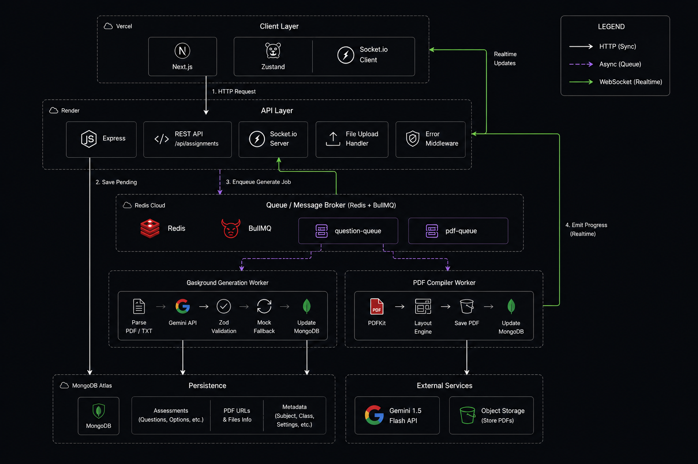

<div align="center">
  
  <h1>VedaAI – AI Assessment Creator</h1>
  <p><strong>Full Stack Engineering Assignment</strong></p>
  
  <a href="https://your-deployed-frontend-link.vercel.app"><strong>🔗 View Live Application</strong></a>
  <br/>
  <em>Backend: https://vedaai-backend-h68w.onrender.com</em>
</div>

---

## 📌 Overview

**VedaAI** is a robust, production-ready AI Assessment Creator built to fulfill the rigorous requirements of a Full Stack Engineering Assignment. It enables educators to effortlessly generate fully structured, dynamic exam papers and interactive quizzes using advanced AI, strictly grounded in custom reference materials (syllabus, textbooks).

This project goes far beyond simple API wrapping by implementing a **decoupled worker architecture** (BullMQ/Redis) for high-latency AI inference, natively drawn **PDF generation**, and **WebSocket-driven real-time progress updates**.

---

## 🎯 Project Expectations vs. Delivery

We strictly adhered to the assignment rubric and successfully implemented every required constraint, alongside all requested bonus features.

| Requirement Area | Expectation | Implementation Details | Status |
| :--- | :--- | :--- | :---: |
| **Frontend UI** | Match Figma designs | Pixel-perfect Tailwind implementation. Glassmorphism, smooth micro-animations, and strict mobile responsiveness (no horizontal overflow). | ✅ |
| **Form Data** | Due date, question types, marks, instructions | Full form with robust validation (no empty/negative values) integrated with **Zustand** state management. | ✅ |
| **AI Generation** | Structured prompts, grouped sections, difficulty tags | Enforced `application/json` schema on Gemini. The frontend parses JSON; it **never** renders raw LLM text. | ✅ |
| **Backend System** | Node.js + Express (TypeScript) | Strongly typed controllers, async handlers, and robust REST APIs. | ✅ |
| **Database** | MongoDB | Storing Assignments, Reference Library context, and auto-graded Submissions. | ✅ |
| **Async Queues** | Redis + BullMQ | Heavy LLM tasks are pushed to `generationQueue`. Prevents HTTP timeouts. | ✅ |
| **Real-time UX** | WebSockets | Worker emits `10%`, `50%`, `100%` progress updates directly to the React frontend via Socket.io. | ✅ |

---

## 🚀 Additional & Bonus Features (High Signal)

Beyond the core rubric, this project implements advanced architectural patterns expected in enterprise SaaS applications:

- 🌟 **Native Programmatic PDF Generation:** Avoided the lazy `window.print()` hack. Built a custom `PDFKit` engine on the Node.js backend that mathematically draws the exam paper, creates structured headers (Name/Roll Number), and properly paginates the output.
- 🌟 **Ephemeral Cloud Storage Resilience:** Engineered a dynamic fallback endpoint (`/api/assignments/:id/download`). If a cloud host (like Render) wipes the temporary PDF from its ephemeral disk, the backend instantly and silently regenerates the file on the fly from the database before downloading.
- 🌟 **AI Context Grounding (RAG):** Built a complete **Reference Library**. Users can upload PDFs/TXTs, which are fed into the LLM context window to force the AI to generate questions strictly adhering to uploaded syllabus guidelines.
- 🌟 **Interactive Auto-Grading Engine:** Converted the static exam paper into an interactive digital quiz. Students can take the test, submit it to the backend, and an AI worker will semantically evaluate their raw text answers against the original rubric, dynamically awarding marks.

---

## 🏗️ Architecture & Flow

The system employs a decoupled, asynchronous processing pattern to guarantee reliability during high-latency LLM generation.



1. **Client Request:** User submits the assignment form. The frontend makes a POST request to `/api/assignments`.
2. **Queueing:** The Express Controller validates the payload, creates a "Pending" DB record, adds the job to the Redis `generationQueue`, and immediately returns an HTTP 200 response to the client.
3. **Background Processing:** A separate BullMQ worker picks up the job. It retrieves any selected Library context files, structures the strict prompt, and queries the Google Gemini API.
4. **WebSocket Sync:** During processing, the worker emits granular progress events (`job_progress`) over WebSockets. The React frontend listens to this channel and renders a dynamic loading progress bar.
5. **PDF Compilation:** Once the AI returns the JSON, the worker programmatically draws the PDF using `PDFKit` and saves it to the disk.
6. **Completion:** The MongoDB document is marked "Completed", and the final WebSocket event triggers the frontend to reveal the rendered exam paper.

---

## 💻 Tech Stack

| Domain | Technologies |
| :--- | :--- |
| **Frontend** | Next.js 14 (App Router), React, Tailwind CSS, Zustand, Socket.io-client, Lucide React |
| **Backend** | Node.js, Express.js, TypeScript, Socket.io, PDFKit, Multer |
| **Database & Cache** | MongoDB (Mongoose), Redis |
| **Queues** | BullMQ |
| **AI Integration** | Google Gemini API (`@google/genai`) |

---

## 🔌 API Documentation

The backend REST API is structurally modularized. Below are the core endpoints:

### Assignments API (`/api/assignments`)
| Method | Endpoint | Description |
| :--- | :--- | :--- |
| `POST` | `/` | Creates a new assignment and dispatches the BullMQ generation job. |
| `GET` | `/` | Retrieves a list of all assignments. |
| `GET` | `/:id` | Fetches a specific assignment and its full JSON structure. |
| `GET` | `/:id/download` | **[Fallback resilient]** Streams the generated PDF. Regenerates on-the-fly if wiped. |
| `DELETE` | `/:id` | Deletes the assignment and unlinks physical disk files. |

### Submissions API (`/api/submissions`)
| Method | Endpoint | Description |
| :--- | :--- | :--- |
| `POST` | `/submit` | Accepts student quiz answers and queues the AI Auto-Grading BullMQ worker. |
| `GET` | `/assignment/:id` | Fetches all submissions/results for a specific assignment. |

### Library API (`/api/library`)
| Method | Endpoint | Description |
| :--- | :--- | :--- |
| `GET` | `/` | Lists all uploaded syllabus/textbook context files. |
| `POST` | `/upload` | Multipart/form-data upload using `multer`. |
| `GET` | `/:id/download` | Secure streaming of library documents with graceful fallbacks. |

---

## 🛠️ Local Setup Instructions

1. **Clone the Repository:**
   ```bash
   git clone https://github.com/AkankshaRaj07/EduGenie.git
   cd EduGenie
   ```

2. **Backend Setup:**
   ```bash
   cd backend
   npm install
   ```
   Create a `.env` file in the `backend` directory:
   ```env
   PORT=5000
   MONGODB_URI=mongodb://localhost:27017/edugenie
   REDIS_HOST=localhost
   REDIS_PORT=6379
   GEMINI_API_KEY=your_gemini_api_key_here
   ```
   Start the backend development server:
   ```bash
   npm run dev
   ```

3. **Frontend Setup:**
   ```bash
   cd ../frontend
   npm install
   ```
   Create a `.env.local` file in the `frontend` directory:
   ```env
   NEXT_PUBLIC_API_URL=http://localhost:5000/api
   ```
   Start the frontend development server:
   ```bash
   npm run dev
   ```

4. **Access the Application:** Open your browser and navigate to `http://localhost:3000`.
